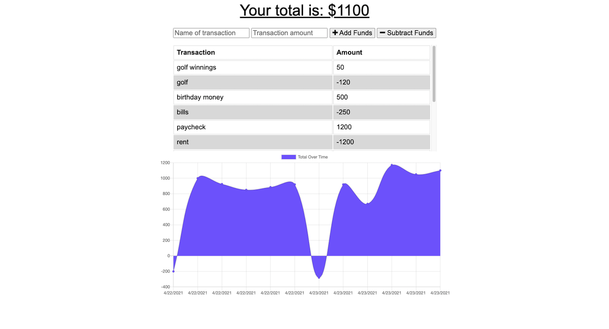

# Budget Tracker

## Deployed Link

[Live Link](https://serene-oasis-36061.herokuapp.com/)

## Table of Contents

* [Purpose](#Purpose)

* [Technologies](#Technologies)

* [Installation](#Installation)

* [Contact](#Contact)

* [License](#License)

## Purpose

A PWA (Progress-Web-APP) that allows uses to enter in their funds whether it be incoming funds or outgoing. If the app is being used in an offline environment and funds are entered in... once the app is back online it will pull the cached data and reflect the changes that were made offline. A chart is nicely attached to fund inputs and will reflect changes based on incoming or outgoing. 

## Technologies

* ***Nodejs***
* ***WebPack***
* ***Dotenv***
* ***Mongo***
* ***BootStrap*** 
* ***Express*** 
* ***JavaScipt***
* ***CSS***
* ***HTML***
* ***API***

## Installation

The live deployed app will take care of the user (no instructions needed).

However if it was needed to run the application locally:

1. Clone the repository on a local machine.
2. Open the apps directory and run a `npm install` to get all dependencies.
3. Create an `.env` file that will store your personal credentials. Follow the `.env.EXAMPLE` model to ensure correct key/value pairs for the MONGODB_URI connection strings.
4. In the command line run `npm run start` to get the server up and running, from there navigate to a browser of choice and access the app by going to `localhost:3000`.

## Contact

* [Email](mailto:josephjlyons90@gmail.com)
* [LinkedIn](www.linkedin.com/in/joseph-lyons-0a2630200/)

## License

Copyright (c) [2021] [Joseph Lyons]
Permission is hereby granted, free of charge, to any person obtaining a copy of this software and associated documentation files (the "Software"), to deal in the Software without restriction, including without limitation the rights to use, copy, modify, merge, publish, distribute, sublicense, and/or sell copies of the Software, and to permit persons to whom the Software is furnished to do so, subject to the following conditions:

The above copyright notice and this permission notice shall be included in all copies or substantial portions of the Software.
